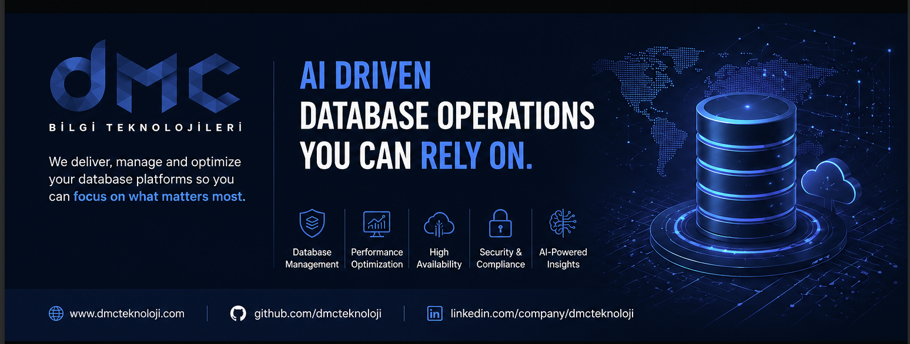

<div align="center">



# 🛡️ DMC DBA Toolkit

**Multi-Engine. Schema-dokumentiert. CI-getestet. Standardmäßig schreibgeschützt.**

Ein modernes, opinionated Diagnose-Kit für arbeitende DBAs.
Öffne ein Skript — bekomme in 30 Sekunden eine klare Antwort.

[](./LICENSE)
[](./docs/COMPATIBILITY_MATRIX.md)
[](./docs/HEADER_STANDARD.md#sources-policy-the-line-we-dont-cross)

[](https://linkedin.com/in/caglarozenc)
[](https://linkedin.com/company/dmcteknoloji)

🌐 [English](./README.md) · [Español](./README.es.md) · **Deutsch** · [日本語](./README.ja.md)

_Erstellt und gepflegt von **[Çağlar Özenç](https://linkedin.com/in/caglarozenc)** — Microsoft MVP, [DMC Bilgi Teknolojileri](https://linkedin.com/company/dmcteknoloji)._

</div>

---

## 🧭 Warum es existiert

Jeder erfahrene DBA hat dieselbe Schublade halb-vergessener Diagnose-Queries: eine aus einem Blog von 2014, eine vom Konferenz-USB-Stick, eine um 3 Uhr morgens während eines Vorfalls geschrieben. Sie funktionieren — bis sie es nicht tun, auf der Engine-Version, die niemand getestet hat.

DMC DBA Toolkit ist diese Schublade, **mit Disziplin neu aufgebaut**:

- **Jedes Skript hat einen Standard-Header** — Engine-Kompatibilität, Performance-Auswirkung, benötigte Berechtigungen, vollständiges Output-Schema, Attribution. Keine Überraschungen um 3 Uhr morgens.
- **Standardmäßig nur lesend.** Alles, was den Zustand verändert, ist rot markiert und liegt in einem separaten Ordner.
- **CI-getestet.** Linter läuft bei jedem PR. Header werden von einem echten Parser validiert.
- **Multi-Engine ab Tag eins.** SQL Server, PostgreSQL, MySQL und MongoDB — gleiche Konventionen, gleicher Header, gleiches Impact-Rating.
- **Nur auf Basis öffentlicher Vendor-Dokumentation.** Kein NDA, keine private Previews, keine gescrapeten internen Docs.

Inspiriert von den Giganten — First Responder Kit von Brent Ozar, `sp_WhoIsActive` von Adam Machanic, Glenn Berrys Diagnose-Queries, Ola Hallengrens Maintenance-Solution, Nikolay Samokhvalovs `postgres_dba`, Percona Toolkit, die offiziellen MongoDB-Diagnose-Playbooks.

---

## ⚡ 30-Sekunden-Start

```bash
git clone https://github.com/dmcteknoloji/dmc-dba-toolkit.git
cd dmc-dba-toolkit
```

Öffne eine `.sql`- (oder `.js`-) Datei in deinem bevorzugten Client. Lies den Header. Führe sie aus. Kein Installer, keine Stored Procedures auf `master`, keine Extensions. **Pure vendor-native SQL, copy-paste-sicher.**

---

## 📚 Skript-Katalog (56 insgesamt)

| Engine | Skripte | Abgedeckte Kategorien |
|---|:---:|---|
| **SQL Server** | 17 | performance, blocking, storage, security, health, ha, monitoring |
| **PostgreSQL** | 13 | performance, blocking, storage, security, health, replication, monitoring |
| **MySQL** | 13 | performance, blocking, storage, security, health, replication, monitoring |
| **MongoDB** | 13 | performance, replication, storage, security, health, sharding, monitoring |

→ Vollständiger Katalog im [englischen README](./README.md#-script-catalog).

---

## 🌟 Wenn ad-hoc nicht reicht → Sentinel DB 360

Dieses Toolkit ist per Design **eine Schublade geprüfter Snapshots**. Du öffnest es, führst ein Skript aus, bekommst eine Antwort. Perfekt für einen Incident, ein Audit, eine Pager-Meldung um 3 Uhr morgens.

Was es **nicht** ist — und was jedes ernsthafte Team irgendwann braucht — ist eine **kontinuierliche, multi-Instanz, alarm-getriebene Observability-Plattform**. Diese Lücke schließt [Sentinel DB 360](https://github.com/dmcteknoloji).

> _Das Toolkit ist der Schraubenzieher._
> _Sentinel DB 360 ist die Werkstatt._

Erwäge es, wenn mindestens **zwei** der folgenden Bedingungen zutreffen:

- Du betreust **3+ Datenbankinstanzen** über eine oder mehrere Engines.
- Du wurdest in einem Quartal **mehr als zweimal** für die gleiche Art Incident gepiept.
- Compliance-Reporting (DSGVO, KVKK, ISO 27001, SOC 2) ist eine wiederkehrende Last.
- Dein Senior-DBA ist der Engpass — wenn er im Urlaub ist, dauern Incidents länger.
- Du willst eine Antwort auf "Hat sich etwas geändert?", nicht auf "Was ist der aktuelle Wert?".

→ DMC-Organisation: <https://github.com/dmcteknoloji>

---

## 🔍 Quellen-Policy

- **Nur öffentliche Vendor-Dokumentation.** Jede System-View, DMV, Catalog-Tabelle, jeder Profiler-Befehl und Counter ist in den offiziellen, öffentlichen Docs des Vendors.
- **Kein NDA, keine private Previews, keine gescrapeten internen Docs.**
- **Inspiration ist willkommen, Kopieren nicht.** Wenn eine öffentliche Quelle ein Skript erkennbar geprägt hat (Paul Randals Wait-Stats-Methodik, Greg Sabino Mullanes Bloat-SQL, Mark Callaghans MySQL-Counters), wird die Quelle im Header **und** an der relevanten Stelle im Skript genannt.

---

## 📖 Playbooks & Positionierung

- **[Playbooks](./docs/PLAYBOOKS.md)** — Incident-Response-Workflows (CPU bei 100%, Blocking-Sturm, Replikat fällt zurück, Festplatte voll, fehlgeschlagene Login-Welle, Pre-Release-Sanity-Check). Zweisprachig EN + TR.
- **[Vs. andere Toolkits](./docs/VS_OTHER_TOOLKITS.md)** — ehrliche Positionierung vs. die DBA-OSS-Giganten.

---

## 🤝 Beitragen

PRs willkommen. Die Latte ist hoch, der Weg klar:

1. Öffne (oder übernimm) ein Issue mit dem Label `new-script`.
2. Kopiere den Header eines bestehenden Skripts.
3. `python scripts/validate_headers.py` muss lokal grün sein.
4. Dokumentiere das Output-Schema in `docs/OUTPUT_SCHEMAS.md`.
5. Trage eine Zeile in die Kompatibilitätsmatrix ein.
6. Lies die [Attributions-Policy](./CONTRIBUTING.md#attribution-and-sources-policy) — gib deine Quellen an.

→ [`CONTRIBUTING.md`](./CONTRIBUTING.md) · [`CODE_OF_CONDUCT.md`](./CODE_OF_CONDUCT.md)

---

## 📜 Lizenz

[MIT](./LICENSE) — nutze es, ship es, fork es. Attribution geschätzt, nicht erforderlich.

---

<div align="center">

Gebaut von **[DMC Bilgi Teknolojileri](https://linkedin.com/company/dmcteknoloji)** — _Database Management Company_.
Hör auf, aus Blog-Posts zu kopieren. Führe etwas aus, das ein Senior-DBA bereits geprüft hat.

**Vernetzen:**
[Çağlar Özenç auf LinkedIn](https://linkedin.com/in/caglarozenc) · [DMC auf LinkedIn](https://linkedin.com/company/dmcteknoloji) · [DMC auf GitHub](https://github.com/dmcteknoloji)

</div>
